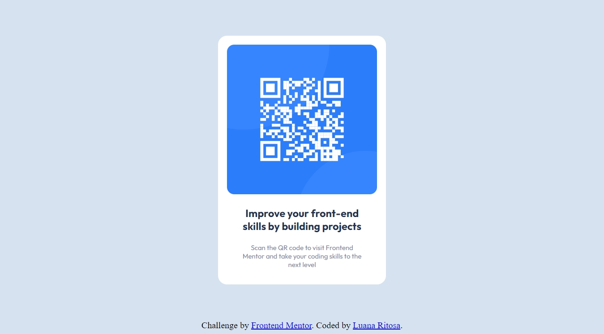

# Frontend Mentor - QR code component solution

This is a solution to the [QR code component challenge on Frontend Mentor](https://www.frontendmentor.io/challenges/qr-code-component-iux_sIO_H). Frontend Mentor challenges help you improve your coding skills by building realistic projects. 

## Table of contents

- [Overview](#overview)
  - [Screenshot](#screenshot)
  - [Links](#links)
- [My process](#my-process)
  - [Built with](#built-with)
- [Author](#author)

## Overview
This is my first project using HTML and CSS only to create a simple QR code component. To complete this challenge I used the code editor "Visual Studio Code" and the designs provided by Frontend Mentor (a mobile and a desktop version of the design in JPG static format). To successfuly complete the challenge, I used the knowoledge obtained in the "Web developer bootcamp 2022" by Colt Steele and some online resources like MDN.

### Screenshot

.

### Links

- Solution URL:(https://github.com/lullich/QR_code_challenge.git)
- Live Site URL:(https://lullich.github.io/QR_code_challenge/)

## My process

To complete this project I used VS Code to write the [HTML markup](./index.html), partially provided by Frontend Mentor, by adding the div elements with their appropriate classes in order to add a custom CSS style. Next, I added two link tags in the head section of my HTML document: one linking to my CSS stylesheet and another one for imported Google Fonts (family Outfit with weights: 400 and 700).
After finishing writing the HTML markup, I created a [CSS stylesheet](./style.css). For the .container width I used the value provided by Frontend Mentor in the [CSS style-guide](./style-guide.md) - 375px for mobile devices so the QR component looks the same on all screen sizes.

### Built with

- Semantic HTML5 markup
- CSS custom properties

## Author

- Website - coming soon!
- Frontend Mentor - [@lullich](https://www.frontendmentor.io/profile/lullich)
